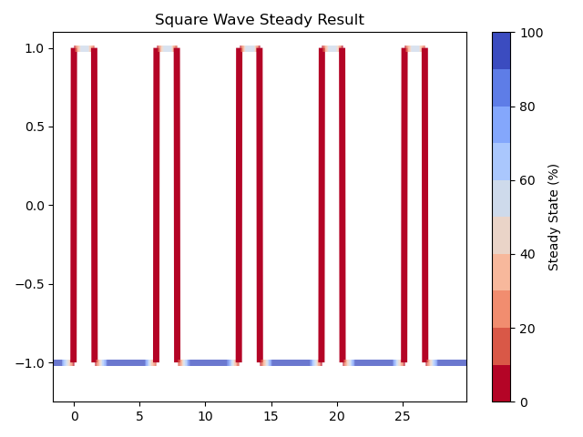

# Steady State Toolkit (SST)
> A collection of methods for identifying steady state behaviour in hypersonic shock tunnel data

### Installation
1. Clone the repo
   ```sh
   git clone https://github.com/muren-94/steady_state_toolkit.git
   ```
2. Run the following in the repo directory to install the package
   ```
   pip3 install -e .
   ```
### Version
0.1.0 Closed Beta <br />
Remaking SST project following python project conventions and implementing best practice and DK previous pull request suggestions

### Roadmap
- [ ] Add KPSS and ADF options
- [ ] Make plotting methods folder and expand
- [ ] Add multi-signal example
- [ ] Add plotting examples to README.md
- [ ] Simple unit testing cases
- [ ] more stuff!

### Example Output
