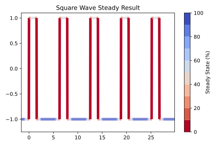

# <span style="color:blue">Quasi</span>.
> Stationarity testing methods for identifying steady state behaviour in hypersonic shock tunnel data

### Installation
1. Clone the repo
   ```sh
   git clone https://github.com/muren-94/HyperSteady.git
   ```
2. Run the following in the repo directory to install the package
   ```
   pip3 install -e .
   ```
### Version
0.1.0 Beta <br />
Remaking steady state project following python project conventions and implementing best practice and DK previous pull request suggestions

### Roadmap
- [X] Add KPSS and ADF options
- [X] Make plotting methods folder and expand
- [ ] Add multi-signal example
- [X] Add plotting examples to README.md
- [ ] Simple unit testing cases
- [ ] more stuff!

### Example Output

